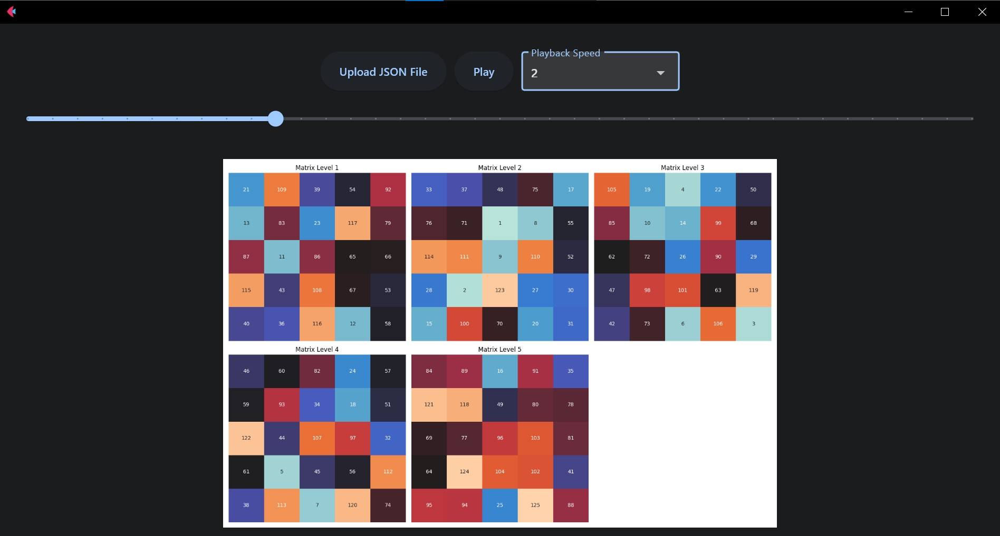

# Finding Solutions for Diagonal Magic Cube Using Local Search
## IF3170 Artificial Intelligence

> Group Member:<br>
> 1. 13522061 Maximilian Sulistiyo<br>
> 2. 13522075 Marvel Pangondian<br>
> 3. 13522083 Evelyn Yosiana<br>
> 4. 13522103 Steven Tjhia<br>
> 5. 13521154 Naufal Baldemar Ardanni <br>
> 
> Sekolah Teknik Elektro dan Informatika<br>
> Institut Teknologi Bandung<br>
> Semester V Tahun 2024/2025


## Table of Contents
* [General Information](#general-information)
* [Features](#features)
* [Setup](#setup)
* [How To Use](#how-to-use)
* [Jobdesc](#job-descriptions)


## General Information
This repository contains code for solving the magic cube 5x5x5 problem with the local search algorithm. The objective function used is the negaitf of how many errors. The error referred to here is a row of numbers with a predetermined position that does not match the magic number. The solution is executed by swapping 2 cells.


## Features
- Steepest Ascent Hill-climbing
- Hill-climbing with Sideways Move
- Random Restart Hill-climbing
- Stochastic Hill-climbing
- Simulated Annealing
- Genetic Algorithm


## Setup

To run this project, make sure you have the following dependencies installed:

- [Python](https://www.python.org/downloads/)
- Flet
```shell
pip install flet
```
- Numpy 
```shell
pip install numpy
```
- Matplotlib 
```shell
pip install matplotlib
```
- Seaborn
```shell
pip install seaborn
```

## How to Run 

1. **Clone the repository**:

   ```shell
   https://github.com/Zechtro/Tubes1_AI.git
   ```

2. **Generate JSON file of Cube result per iteration while displaying Objective Function plot on each iteration**

   Pro Tip: keep this terminal running to compare the step-by-step visualization (because sometimes there is no change of cube state (flat objective function) so the cube state doesn't change on the "video player")

   ```shell
   python src/Main.py
   ```

   or

   ```shell
   python3 src/Main.py
   ```

3. **Run GUI to visualize step-by-step of algorithm used on "video player"**

   ```shell
   python gui.py
   ```

   or

   ```shell
   python3 gui.py
   ```

## Job Descriptions

| NIM      | Responsibilities                                                                                                           |
|----------|----------------------------------------------------------------------------------------------------------------------------|
| 13522061 | Steepest Ascent HC, HC with Sideways Move, Random Restart HC, GUI, Report                                                  |
| 13522075 | Steepest Ascent HC, HC with Sideways Move, Random Restart HC, Stochastic HC, Simulated Annealing, Genetic Algorithm, Report|
| 13522083 | Steepest Ascent HC, HC with Sideways Move, Random Restart HC, GUI (bonus), Report                                          |
| 13522103 | Visualization, Genetic Algorithm, Report                                                                                   |
| 13521154 | Simulated Annealing, Stochastic HC, Report                                                                                 |